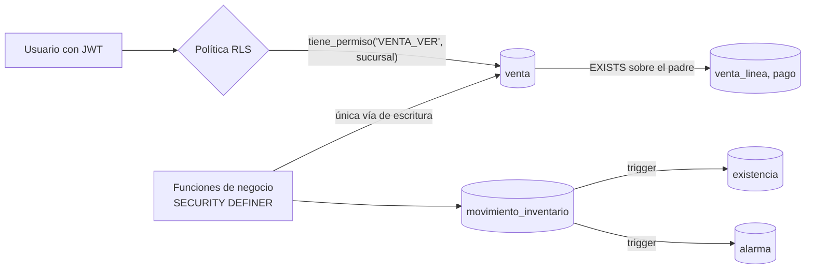

<div align="center">

# MercaditoPOS · Backend de datos

**Modelo de datos, seguridad por filas y reportes en Supabase (PostgreSQL)**
para el sistema integral de supermercado MercaditoPOS (Honduras).


</div>

> Proyecto académico (Programación I, 2026). Este repositorio cubre la parte de **Líder Backend /
> arquitectura de datos**: modelo completo, migraciones, políticas RLS, kardex, catálogo y precios,
> clientes y lealtad, alarmas y reportes. Todos los datos de ejemplo son ficticios.

## Índice
- [Qué incluye](#qué-incluye)
- [Estructura](#estructura)
- [Inicio rápido](#inicio-rápido)
- [Cómo está protegida la información](#cómo-está-protegida-la-información)
- [Verificación](#verificación)
- [Documentación](#documentación)
- [Lo que falta y de quién es](#lo-que-falta-y-de-quién-es)

## Qué incluye

| Área | Qué hay | Requerimientos |
|---|---|---|
| **Modelo de datos** | 70 tablas en 13 migraciones versionadas, en tercera forma normal, con las reglas del PRD como restricciones (`CHECK`, únicos parciales, exclusión de rangos) | doc 05, 09, 10, 12 |
| **Catálogo y precios** | Productos, códigos de barras con dígito verificador EAN-13, precio por sucursal con vigencia **sin traslapes**, búsqueda F2, consulta por código para la caja, margen y precio sugerido | RF-CAT-01..04, RN-21 |
| **Inventario y kardex** | Existencia mantenida por **trigger** en la misma transacción que el movimiento; costo promedio ponderado; kardex con saldo inicial/final y ventas por día; existencia disponible (menos ventas abiertas y lotes caducados) | RF-KDX-01..06, RF-EXI-01..05, RN-14 |
| **Alarmas** | Sin existencia, negativa, bajo mínimo, reorden, sobre máximo (al momento) y caducados / por caducar (cada noche con `pg_cron`); sin duplicados; se resuelven solas; historial | RF-ALM-01..06, RN-ALM-01 |
| **Clientes y lealtad** | Registro con consentimiento obligatorio y RTN; tarjeta automática; puntos solo por movimientos; anonimización (ARCO) | RF-CLI-01..06 |
| **Reportes** | Ventas por día/hora/sucursal/caja/cajero/categoría/producto/forma de pago, tablero del día, **libro de ventas SAR**, resumen de ISV, ventas sin factura | RF-REP-01..02, RF-SAR-12, RF-DOC-06 |
| **Seguridad** | RLS en todas las tablas, 123 políticas por permiso y sucursal | doc 10 §9.1 |
| **Contrato de API** | `api/openapi.yaml` para catálogo, inventario, alarmas, clientes y reportes | doc 06 §5 |

## Estructura

```
.
├── supabase/
│   ├── migrations/            # 13 migraciones en orden (fuente de verdad del esquema)
│   ├── seed.sql               # datos ficticios: 3 sucursales, 16 productos, roles, CAI de prueba…
│   └── config.toml            # configuración de la Supabase CLI
├── api/
│   └── openapi.yaml           # contratos de API de estos módulos
├── tests/db/                  # 81 pruebas contra Postgres real (PGlite)
│   ├── supabase-stub.sql      # emula roles y auth.uid() de Supabase
│   ├── db.mjs                 # crea la base, enlaza usuarios, ejecuta "como" un usuario
│   └── *.test.mjs             # catálogo · inventario y kardex · RLS · SAR, reportes y clientes
├── docs/
│   ├── modelo-datos.md        # migraciones, diagrama, cómo funciona el kardex
│   ├── rls.md                 # qué protege cada política y por qué (para la defensa)
│   ├── decisiones.md          # contradicciones del PRD y cómo se resolvieron
│   ├── contrato-equipo.md     # qué debe respetar cada integrante que use la base
│   ├── guia-supabase.md       # cómo aplicar todo en los proyectos de Supabase
│   └── ia/bitacora.md         # bitácora de uso de IA
└── .github/workflows/ci.yml   # pruebas + validación del contrato en cada PR
```

## Inicio rápido

**Probar todo localmente (sin Docker ni cuenta de Supabase):**

```bash
npm ci
npm test        # crea la base, aplica las 13 migraciones y la semilla, corre 81 pruebas
```

**Aplicar en un proyecto de Supabase** (detalle en [docs/guia-supabase.md](docs/guia-supabase.md)):

```bash
supabase link --project-ref <ref>
supabase db push --include-seed
```

## Cómo está protegida la información



- **Lectura por permiso y sucursal**: el cajero del Norte no ve nada del Centro; el gerente general ve todo.
- **Escritura transaccional solo por funciones** que validan reglas: un `insert into venta` desde el navegador falla aunque el usuario tenga `VENTA_CREAR`.
- **La existencia nunca se edita**: solo cambia con un movimiento del kardex, que es de solo inserción.
- **Vistas `security_invoker`**: los reportes respetan el RLS de las tablas que leen.

Explicación política por política en [docs/rls.md](docs/rls.md).

## Verificación

| Qué | Cómo |
|---|---|
| Migraciones aplican limpias y en orden | `npm test` las aplica todas desde cero en cada archivo de pruebas, sobre **PostgreSQL 17** (misma versión mayor que Supabase) |
| Reglas de negocio | Casos del PRD como pruebas: `CP-KDX-01` (42 + 96 − 130 = 8), `CP-KDX-02` (costo 40.67), `CP-EXI-02`, `CP-ALM-01`, `CP-COD-02/03`… |
| RLS | Cada prueba entra con el rol `authenticated` y el JWT del usuario, igual que una petición real. Meta-pruebas: toda tabla con RLS, toda vista `security_invoker`, toda función definer con `search_path` |
| Las pruebas detectan errores | Prueba de mutación: al romper a propósito dos políticas y una vista, las pruebas fallaron |
| Contrato de API | `npm run lint:api` (Redocly) |

## Documentación

- [Modelo de datos](docs/modelo-datos.md) · [Seguridad por filas](docs/rls.md) · [Decisiones](docs/decisiones.md)
- [Contrato con el equipo](docs/contrato-equipo.md) · [Guía de Supabase](docs/guia-supabase.md) · [Bitácora de IA](docs/ia/bitacora.md)

## Lo que falta y de quién es

| Pendiente | Responsable (doc 11) |
|---|---|
| `registrar_venta`, `siguiente_correlativo`, `generar_codigo_interno`, recepción, ajustes, devoluciones, promociones | Módulos de negocio y SAR |
| Supabase Auth, cuentas reales, bitácora por triggers con hash encadenado, CI/CD a los proyectos | Seguridad y DevOps |
| API NestJS que exponga `api/openapi.yaml` | Equipo Backend |
| Aplicar las migraciones en `mercadito-dev` / `mercadito-qa` | Arquitectura de datos (con acceso al proyecto) |
| Confirmar tasas de ISV y código SAR de nota de crédito | Con el docente |
| Fase 2: transferencias, conteos, cuentas por pagar, caducidad de puntos, cifrado de datos personales | — |

## Licencia

Código bajo licencia [MIT](LICENSE).
