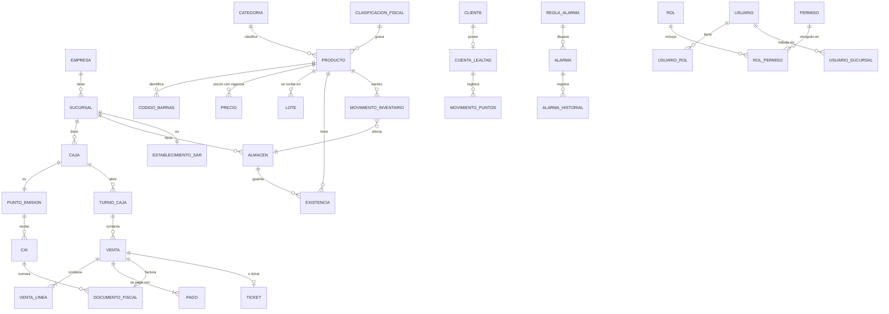
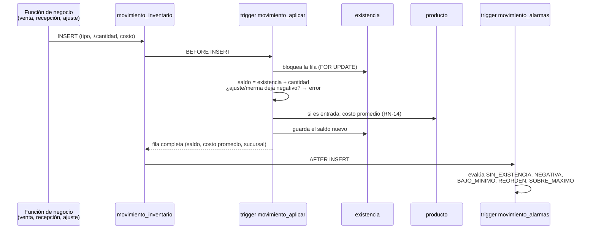

# Modelo de datos

Implementación en Supabase (PostgreSQL) del modelo del doc 05, con los ajustes de [decisiones.md](decisiones.md).
**70 tablas, 9 vistas, 38 funciones y 123 políticas RLS**, en 13 migraciones.

## 1. Migraciones

| Archivo | Contenido |
|---|---|
| `…0100_extensiones_y_utilidades` | `btree_gist`; validación EAN-13 y RTN; triggers genéricos (`actualizado`, solo inserción) |
| `…0200_organizacion` | empresa, sucursal, caja, almacén |
| `…0300_seguridad` | usuario (↔ `auth.users`), rol, permiso, matriz, límites, segregación, autorizaciones, bitácora; `usuario_actual_id()`, `tiene_permiso()` |
| `…0400_catalogo` | clasificación fiscal, categoría, marca, unidad, producto, códigos de barras, precios con vigencia, venta rápida, etiquetas; `precio_vigente()`, `programar_precio()` |
| `…0500_sar` | configuración fiscal, establecimientos, puntos de emisión, tipos de documento, CAI, bloques; `formato_numero_fiscal()` |
| `…0600_inventario` | lote, existencia, **kardex** + trigger de existencias y costo promedio; ajustes, transferencias y conteos |
| `…0700_compras` | proveedores, OC, recepciones, cuentas por pagar |
| `…0800_clientes_y_promociones` | cliente, lealtad, puntos (+ triggers), `anonimizar_cliente()`; promociones |
| `…0900_caja_y_ventas` | formas de pago, turnos, cortes, venta, líneas, pagos, documento fiscal, ticket, devoluciones |
| `…1000_alarmas` | reglas, alarmas, historial; evaluación automática y nocturna; `atender_alarma()` |
| `…1100_rls` | RLS en todas las tablas y sus políticas ([rls.md](rls.md)) |
| `…1200_consultas_y_reportes` | Catálogo para caja, existencias, kardex, reportes de ventas, dashboard, libro de ventas, clientes, alarmas |
| `…1300_tareas_programadas` | `pg_cron`: alarmas de caducidad cada noche |

## 2. Diagrama general

Los diagramas detallados con todas las columnas están en los docs 05, 09, 10 y 12 del PRD; las columnas
finales son las de las migraciones.

## 3. El kardex: cómo se mantiene la existencia

- Todo ocurre en **la misma transacción** que la venta o la recepción: si algo falla, no queda nada a medias.
- El candado sobre la fila de existencia hace que dos cajas que venden el mismo producto se formen en fila.
- **Costo promedio (RN-14):** `(existencia × costo actual + cantidad × costo de entrada) / (existencia + cantidad)`,
  con la existencia de todos los almacenes. Ejemplo CP-KDX-02: `(24 × 40 + 48 × 41) / 72 = 40.67`.
- El kardex nunca se corrige editando: se inserta un movimiento contrario.

## 4. Tipos de datos (doc 05 §2.5)

| Dato | Tipo |
|---|---|
| Llaves | `bigint generated by default as identity`; `uuid` en `venta` (lo genera la caja) |
| Montos | `numeric(12,2)` |
| Cantidades | `numeric(12,3)` (granel con 3 decimales, RN-03) |
| Costos | `numeric(12,4)` |
| Fechas | `timestamptz`; los reportes agrupan por día en hora de Honduras (`America/Tegucigalpa`) |

## 5. Índices

Además de las llaves primarias y únicas: búsqueda por nombre con trigramas (`pg_trgm`) para F2, precio vigente,
ventas por sucursal y fecha, ventas por turno, líneas por producto, kardex por producto/almacén/fecha, lotes por
caducidad, alarmas abiertas por sucursal, bitácora por entidad. Los índices únicos parciales implementan reglas
de negocio: un turno abierto por caja, un CAI activo por punto, una alarma abierta por tipo/producto/sucursal,
una factura vigente por venta.
