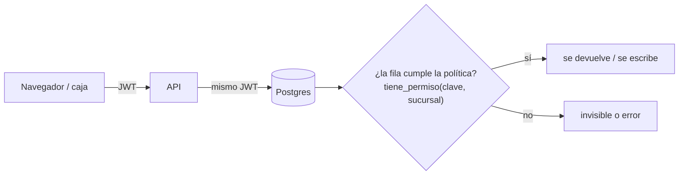

# Seguridad por filas (RLS): qué protege cada política y por qué

> Para la defensa oral (doc 11 §15.3): "explicar **por qué cada política RLS protege lo que protege**".
> Código: [`supabase/migrations/20261008001100_rls.sql`](../supabase/migrations/20261008001100_rls.sql).
> Pruebas: [`tests/db/03-rls.test.mjs`](../tests/db/03-rls.test.mjs).

## 1. Cómo funciona en Supabase

1. El usuario inicia sesión con **Supabase Auth** y recibe un **JWT**.
2. Cada petición llega a Postgres con el rol `authenticated` y el JWT; `auth.uid()` devuelve el `id` del usuario.
3. Postgres agrega en silencio la condición de la política a cada consulta. Una fila que no la cumple **no existe** para ese usuario.
4. Sin política para una operación = operación prohibida. Por eso activar RLS sin políticas cierra la tabla por completo.

## 2. Las funciones que usan las políticas

| Función | Qué responde | Detalle importante |
|---|---|---|
| `usuario_actual_id()` | El empleado (`usuario.id_usuario`) del JWT | Nulo si no hay sesión, si está inactivo o bloqueado → **RN-ROL-08**: dar de baja corta el acceso en la siguiente consulta |
| `tiene_permiso(clave, sucursal)` | ¿Alguno de sus roles vigentes tiene ese permiso en esa sucursal? | Une todos sus roles (**RN-ROL-04**). Respeta `vigente_desde/hasta` (delegaciones). Un rol con alcance `TODAS` vale para cualquier sucursal; si no, la sucursal debe estar en `usuario_sucursal`. Con sucursal nula pregunta "en alguna sucursal" |
| `tiene_permiso_global(clave)` | ¿Lo tiene en un rol con alcance de empresa? | Se usa para el precio general |

Las tres son `SECURITY DEFINER` porque leen `usuario_rol`, `rol_permiso`, etc., que a su vez tienen RLS: si corrieran
como el usuario, la política se llamaría a sí misma sin fin. Fijan `search_path = ''` para que nadie pueda
"secuestrarlas" creando una tabla con el mismo nombre en otro esquema (una prueba verifica esto en **todas** las funciones definer).

## 3. Reglas generales

| Regla | Por qué |
|---|---|
| RLS activo en **todas** las tablas de `public` (hay una prueba que lo verifica) | Una tabla olvidada sería una puerta abierta con la llave `anon` |
| `revoke all ... from anon` | Sin sesión no se lee ni el catálogo |
| Vistas con `security_invoker = true` | Una vista normal corre con los permisos de su dueño y **se salta el RLS**. La prueba de mutación lo demostró: al quitarlo, el cajero del Norte vio existencias del Centro |
| Tablas hijas heredan del padre con `exists (select 1 from padre ...)` | La subconsulta al padre también pasa por el RLS del padre: si no ves la venta, no ves sus líneas ni sus pagos |
| Ventas, caja, documentos, kardex y puntos **sin políticas de escritura** | Solo se escriben por funciones `SECURITY DEFINER` que validan reglas de negocio. Un INSERT directo desde el navegador falla aunque tenga el permiso |
| Funciones internas sin `execute` para la API | `evaluar_alarmas_caducidad`, `sincronizar_alarma`… solo las llaman triggers y `pg_cron` |

## 4. Política por módulo

### Organización y configuración
| Tabla | Leer | Escribir | Por qué |
|---|---|---|---|
| empresa, sucursal, caja, almacén | Cualquier empleado con sesión | `CONFIG_EDITAR` (crear sucursal: alcance de empresa) | Todos necesitan los nombres para trabajar; cambiarlos es de administración |

### Seguridad
| Tabla | Leer | Escribir | Por qué |
|---|---|---|---|
| usuario | La fila propia o `USUARIOS_ADMIN` | `USUARIOS_ADMIN` | Datos de empleados: cada quien ve solo los suyos |
| rol, permiso, rol_permiso, rol_limite | Cualquier empleado | `ROLES_ADMIN`, y **no** en un rol que el propio administrador tenga | **RN-ROL-02**: nadie se da permisos a sí mismo |
| usuario_rol, usuario_sucursal | Las propias o `USUARIOS_ADMIN` | `USUARIOS_ADMIN` y `id_usuario <> yo` | **RN-ROL-02** |
| bitacora_auditoria | `BITACORA_VER` | INSERT solo con `id_usuario = yo`; nunca UPDATE/DELETE (además un trigger lo bloquea incluso al dueño) | **RN-18**: nadie falsifica ni borra el rastro, ni a nombre de otro |

### Catálogo y precios
| Tabla | Leer | Escribir | Por qué |
|---|---|---|---|
| producto, categoría, marca, unidad, código de barras | `CATALOGO_VER` | `CATALOGO_EDITAR` | La caja lee el catálogo; solo Compras/Gerencia lo cambia. El Admin TI no lo ve (**RN-ROL-06**) |
| precio | `CATALOGO_VER` | De sucursal: `PRECIO_EDITAR` en esa sucursal. General: `PRECIO_EDITAR` con alcance de empresa. Siempre `id_usuario_cambio = yo` | Un gerente de sucursal no cambia precios de otras; el cambio queda firmado por quien lo hizo |
| categoría rápida, botones | `CATALOGO_VER` en la sucursal | `CATALOGO_EDITAR` en la sucursal | Cada tienda arma su pantalla táctil |

### Inventario
| Tabla | Leer | Escribir | Por qué |
|---|---|---|---|
| existencia | `INVENTARIO_VER` o `VENTA_CREAR` en la sucursal del almacén | **Nadie** (solo el trigger del kardex) | La existencia no se "corrige a mano": se corrige con un movimiento que queda en el kardex |
| movimiento_inventario | `INVENTARIO_VER` en la sucursal | **Nadie** directo | Kardex inmutable (RF-KDX-01) |
| ajuste_inventario | `INVENTARIO_VER` | INSERT con `INVENTARIO_AJUSTAR`, en estado PENDIENTE y a nombre propio | Almacén propone, gerencia aprueba (segregación) |
| existencia_disponible() | Función definer que exige `VENTA_CREAR` o `INVENTARIO_VER` en la sucursal | — | Le dice al cajero cuánto hay en otras sucursales (RF-EXI-04) **sin** abrirle el inventario de esas sucursales |

### Compras, clientes, promociones
| Tabla | Leer | Escribir | Por qué |
|---|---|---|---|
| proveedor, producto_proveedor | `COMPRAS_VER` | `COMPRAS_CREAR` | Costos pactados son información sensible |
| orden_compra, recepción | `COMPRAS_VER` en la sucursal | Por funciones del módulo de compras | Aprobación con límite de monto (RN-12) |
| cliente | `CLIENTE_VER` | INSERT `CLIENTE_CREAR`; UPDATE y anonimizar `CLIENTE_DATOS_PERSONALES` | El cajero registra, pero cambiar o borrar datos personales (ARCO) es de un permiso aparte |
| cuenta_lealtad, movimiento_puntos | `CLIENTE_VER` | Nadie directo (trigger / funciones) | El saldo solo cambia con movimientos |
| promoción | `CATALOGO_VER` | `PROMO_EDITAR` | |

### Caja, ventas y documentos
| Tabla | Leer | Escribir | Por qué |
|---|---|---|---|
| venta | Las propias, o `VENTA_VER` / `REPORTES_VER` en la sucursal | Nadie directo | El cajero ve lo que vendió; el supervisor, toda su tienda; nadie, otras tiendas |
| venta_linea, pago, devolución | Heredan de la venta | Nadie directo | |
| turno, corte, movimiento de caja | El turno propio, o `CAJA_CORTE` / `REPORTES_VER` en la sucursal | Nadie directo | |
| cai | `SAR_VER`, o `VENTA_CREAR` en la sucursal del punto de emisión | `SAR_CONFIGURAR` | La caja necesita leer su CAI para imprimir; solo contabilidad lo registra |
| documento_fiscal, ticket | `SAR_REPORTES` o heredan de la venta | Nadie directo; además un trigger impide borrar o cambiar número, montos o fecha | RN-SAR-01 |

### Alarmas
| Tabla | Leer | Escribir | Por qué |
|---|---|---|---|
| alarma | `ALARMAS_VER` en la sucursal | Por trigger; se atienden con `atender_alarma()` que exige `ALARMAS_GESTIONAR` | Cada cambio queda en el historial |
| regla_alarma | `ALARMAS_VER` | `ALARMAS_REGLAS` | |

## 5. La llave `service_role`

Se salta todo el RLS. Solo vive en los secretos del servidor y de GitHub Actions, y solo se usa para
procesos sin usuario (migraciones, `pg_cron`, tareas de mantenimiento). Para atender a un usuario la API
**reenvía su JWT**; si usara `service_role`, todas estas políticas dejarían de existir.

## 6. Preguntas de práctica para la defensa

1. ¿Por qué `tiene_permiso` es `SECURITY DEFINER`? ¿Qué pasaría si no lo fuera?
2. Una vista que muestra existencias: ¿qué pasa si se crea sin `security_invoker`?
3. El cajero tiene `VENTA_CREAR`. ¿Por qué aun así no puede hacer `insert into venta` desde el navegador?
4. ¿Cómo se cumple RN-ROL-02 ("nadie se modifica sus propios permisos")?
5. ¿Qué pasa con la sesión de un cajero que se dio de baja hace un minuto?
6. ¿Cómo sabe el cajero cuánto pan hay en la sucursal Norte si no puede leer el inventario del Norte?
